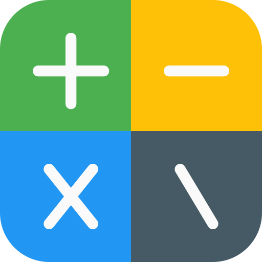

<p align="center">
  
</p>


# SmartCalc 


 It is new way to do calculate on-fly. Do your calculation on text based queries and see the result immediately. Still it is under development but it is enough to use it on daily purpose. Supports money conversion, percentage calculation and basis time calculation but still not fully supported. For now, we support only in english language but if any want to help to translate, we can easily integrate new language.


## Why SmartCalc?
You can download the application or you can use it on the web. If you want you can integrate into your own product and it is totally free. Supports multiple type to do dailly basic calculation based on requirements.
**SmartCalc** helps long-term calculation based on your requirements and real-world problems and simplifies to use it in the text. If you want to buy a house and you don't know how much money you need to save for initial payment, you can do it very easily at **SmartCalc**. Or you can just do a simple calculations of how old you are.

<p align="center">
  
</p>

## Usage

**Minimum Supported Rust Version**: 1.56.0

First, depend on it in your Cargo manifest:

```toml
[dependencies]
smartcalc = "1"
```

## Binaries
Desktop binaries are located under [Releases](https://github.com/erhanbaris/smartcalc/releases) section, also you can use [web application](https://erhanbaris.github.io/smartcalc-app/).

You can check the [SmartCalc-App](https://github.com/erhanbaris/smartcalc-app) repository for application source codes.

## Supported operations

### Money
Has a 162 different currency support internally and conversions between two currency.


<p align="center">
  
</p>


### Number
You can do normal mathematical calculation with SmartCalc

```
10 * 20        |        200
30 / 3         |         10
10 * 20 + 40   |        240
10 / 3         |          3.33333333
100 to binary  |  0b1100100
100 to oct     |      0o144
100 to hex     |       0x64
```

Also support percentage calculation.
```
10% of 200    |  20
10% off 200   | 180
10% on 200    | 220
120 + 10%     | 132
500 - 30%     | 350
```
Percentage calculation applied to currencies.
```
10% of 200 try    | ₺20,00
10% off 200 try   | ₺180,00
10% on 200 try    | ₺220,00
120 usd + 10%     | $132.00
500 euro - 30%    | 350,00 €
```

The system supports a little bit of complex calculation like
```
15.5 is what % of 1100   |   %14.09
180 is 10% of what       |   1.800
```

### Date, Time and Timezone
Dynamically date and time calculation supported. If you want to do count days or diff dates, it is very easy now. Also, timezone conversion are supported.
```
today                    |   15 February
tomorrow                 |   16 February
yesterday                |   14 February
12/02/2020 - 1 days      |   11 Feb 2020
tomorrow + 3 weeks       |    9 March
3/3/2021 to 1/1/2000     |   21 years 2 months 1 week
100 minutes 1 seconds    |    1 hour 40 minutes 1 second
11:30 add 30 minute      |   12:00:00 CET
11:30 to EST             |   05:30:00 EST
```

### Memory
You can also do computer memory unit calculations.
```
1024 mb                  |   1.024MB
1 mega byte              |   1MB
1mb to byte              |   1.048.576B
```

Also, abbreviation supported for all number types.
```
$1k                      |   $1,000.00
1M + 1k                  |   1.001.000
```

### Number Type Conversion 
Programmers can convert numbers from one type to another type.
Here is the supported types:

- Octal
- Hexadecimal
- Decimal
- Binary

To use all number types except hexa, you must use the type's name. Since the word hexadecimal is long,  hex  word can be used.

```
10 hex                   |   0xA
10 hex to octal          |   0o12
0x12 to binary           |   0b10010
data = 10 hex            |   0xA
data decimal             |   10
```

### Variable definition
You can store information in variable and use it again in formulas.
```
gross salary = 100k dkk           | 100.000,00 kr.
net salary   = gross salary - %40 |  60.000,00 kr.
daily wages  = net salary / 30    |   2.000,00 kr.
as euro = daily wages as euro     |     268,82 €
as euro                           |     268,82 €
```

## Implementations

[Web Application](erhanbaris.github.io/smartcalc-web/)

[smartcalc-tui](https://github.com/superhawk610/smartcalc-tui)
